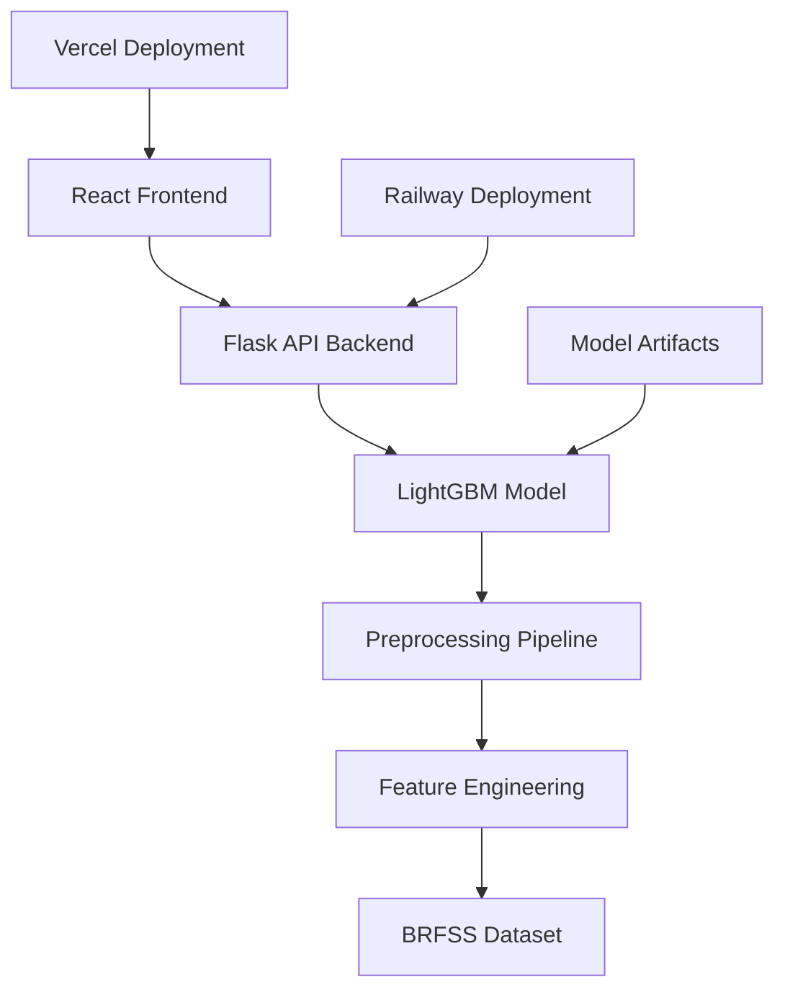

# Type 2 Diabetes AI Prediction Platform

<div align="center">


**A state-of-the-art machine learning platform for predicting Type 2 Diabetes progression using the BRFSS dataset**

[🚀 Live Demo](https://your-vercel-app.vercel.app) • [📖 Documentation](./documentation.md) • [🔬 Research](./src/pages/Research.tsx) • [⚡ API Docs](./backend.md)

</div>

---

## 🎯 Overview

This platform leverages the **Behavioral Risk Factor Surveillance System (BRFSS)** dataset—a nationally representative dataset with over **200,000 responses** and **30+ multivariate health indicators**—to predict Type 2 Diabetes progression using advanced machine learning techniques.

**Academic Research Project**: This work was conducted under the faculty guidance of the **School of Artificial Intelligence, North Chiang Mai University, Thailand** as part of a collaborative summer internship program by students from **SRM University - AP, India**.

### 🎖️ Key Achievements
- **85.42%** Test Accuracy with LightGBM
- **97.77%** Specificity (Low False Positive Rate)
- **57.95%** Precision on Diabetes Class
- **Production-ready** deployment on cloud infrastructure

## 🏗️ System Architecture



### 🧠 ML Pipeline
1. **Data Preprocessing**: Polynomial feature expansion (21 → 231 features)
2. **Feature Selection**: SelectKBest with ANOVA (231 → 75 features) 
3. **Class Balancing**: BorderlineSMOTE for balanced training
4. **Model Training**: Threshold-optimized LightGBM classifier
5. **Validation**: 5-fold stratified cross-validation

## 🚀 Features

### 🔬 **Advanced ML Model**
- **LightGBM Classifier** with hyperparameter optimization
- **Polynomial Feature Engineering** for complex interactions
- **Feature Selection** using statistical methods (ANOVA)
- **Class Balancing** with BorderlineSMOTE resampling
- **Threshold Optimization** for optimal precision-recall balance

### 💻 **Modern Web Interface**
- **Interactive Risk Assessment Form** with 21 health indicators
- **Real-time Predictions** with instant results
- **Responsive Design** optimized for all devices
- **Data Visualizations** for model performance analysis
- **Professional UI** built with React + TypeScript

### 🔄 **Production Infrastructure**
- **Scalable Backend** deployed on Railway
- **Fast Frontend** deployed on Vercel
- **CORS-enabled API** for cross-origin requests
- **Error Handling** with comprehensive logging
- **Health Monitoring** endpoints

## 📊 Model Performance

| Metric | Value | Description |
|--------|-------|-------------|
| **Accuracy** | 85.42% | Overall classification accuracy |
| **Precision** | 57.95% | Diabetes class precision |
| **Recall** | 17.05% | Diabetes class sensitivity |
| **Specificity** | 97.77% | Non-diabetes class specificity |
| **F1-Score** | 26.00% | Harmonic mean of precision/recall |

> **Note**: The model is optimized for high specificity to minimize false positives in clinical settings, which is crucial for diabetes screening applications.

## 🛠️ Tech Stack

### Frontend
- **React 18** with TypeScript for type safety
- **Vite** for fast development and building  
- **Tailwind CSS** for modern styling
- **shadcn/ui** for professional UI components
- **React Hook Form** for form management
- **Recharts** for data visualizations

### Backend  
- **Flask** web framework with RESTful API
- **LightGBM** for machine learning predictions
- **scikit-learn** for preprocessing pipeline
- **pandas** for data manipulation
- **Gunicorn** for production WSGI server

### Deployment & DevOps
- **Vercel** for frontend hosting
- **Railway** for backend deployment
- **Git** version control with branch strategies
- **Environment Variables** for configuration management

## 🚀 Quick Start

### Prerequisites
- **Node.js** 16+ and npm/yarn
- **Python** 3.9+ with pip
- **Git** for version control

### 1. Clone Repository
```bash
git clone https://github.com/Venkat-Kolasani/type2diabetes-ai.git
cd type2diabetes-ai
```

### 2. Frontend Setup
```bash
# Install dependencies
npm install

# Create environment file
echo "VITE_BACKEND_URL=http://localhost:5001" > .env

# Start development server
npm run dev
```

### 3. Backend Setup
```bash
cd backend

# Install Python dependencies
pip install -r requirements.txt

# Ensure model files exist
ls model/model.pkl model/preprocessing_pipeline.pkl

# Start Flask development server
python app.py
```

### 4. Access Application
- **Frontend**: http://localhost:8080
- **Backend API**: http://localhost:5001
- **Health Check**: http://localhost:5001/health

## 📡 API Reference

### Prediction Endpoint
```http
POST /predict
Content-Type: application/json

{
  "HighBP": 0,
  "HighChol": 0,
  "CholCheck": 1,
  "BMI": 25.5,
  "Smoker": 0,
  "Stroke": 0,
  "HeartDiseaseorAttack": 0,
  "PhysActivity": 1,
  "Fruits": 1,
  "Veggies": 1,
  "HvyAlcoholConsump": 0,
  "AnyHealthcare": 1,
  "NoDocbcCost": 0,
  "GenHlth": 3,
  "MentHlth": 2,
  "PhysHlth": 1,
  "DiffWalk": 0,
  "Sex": 1,
  "Age": 5,
  "Education": 6,
  "Income": 5
}
```

**Response:**
```json
{
  "prediction": 0
}
```

### Health Check Endpoint
```http
GET /health
```

**Response:**
```json
{
  "status": "ok",
  "model_loaded": true,
  "debug": {
    "model_loaded": true,
    "status": "ok"
  }
}
```

## 📊 Dataset Information

### BRFSS Dataset Features
- **Sample Size**: 200,000+ individuals
- **Features**: 21 core health indicators
- **Categories**: Demographics, Clinical, Lifestyle, Mental Health
- **Target**: Binary diabetes classification

### Feature Categories
| Category | Features | Examples |
|----------|----------|----------|
| **Demographics** | 4 | Age, Sex, Education, Income |
| **Clinical** | 8 | BMI, Blood Pressure, Cholesterol |
| **Lifestyle** | 5 | Physical Activity, Smoking, Alcohol |
| **Health Status** | 4 | General Health, Mental/Physical Health Days |

## 🔬 Research & Methodology

Our research methodology follows rigorous machine learning best practices:

1. **Data Preprocessing**: Comprehensive cleaning and encoding
2. **Feature Engineering**: Polynomial expansion and interaction terms  
3. **Model Selection**: Comparative analysis of multiple algorithms
4. **Hyperparameter Tuning**: Grid search with cross-validation
5. **Performance Evaluation**: Multiple metrics and validation strategies

For detailed methodology, see our [Research Documentation](./src/pages/Research.tsx).

## 🏥 Clinical Applications

This platform is designed to support:

- **Primary Care Screening**: Early diabetes risk assessment
- **Population Health**: Large-scale diabetes surveillance  
- **Preventive Medicine**: Identifying high-risk individuals
- **Health Education**: Personalized risk factor awareness
- **Research**: Diabetes progression studies

> **⚠️ Disclaimer**: This tool is for research and educational purposes. Always consult healthcare professionals for medical decisions.

## 🤝 Contributing

We welcome contributions! However, please note our licensing restrictions:

1. **View Implementation**: ✅ Code review and learning
2. **Fork for Learning**: ✅ Educational purposes
3. **Commercial Use**: ❌ Restricted (see LICENSE)
4. **Model Distribution**: ❌ Not permitted

### Development Guidelines
- Follow TypeScript/Python best practices
- Maintain test coverage above 80%
- Document all new features
- Ensure backward compatibility

## 📄 License

This project is licensed under a **Custom Restrictive License** - see the [LICENSE](./LICENSE) file for details.

**Key Restrictions:**
- ✅ **View & Study**: Code examination for learning
- ✅ **Academic Use**: Research and educational purposes  
- ❌ **Commercial Use**: Not permitted without explicit permission
- ❌ **Model Distribution**: ML models are proprietary
- ❌ **Derivative Works**: Commercial derivatives prohibited

## 👥 Authors & Acknowledgments

### Academic Collaboration
This research was conducted under the faculty guidance of the **School of Artificial Intelligence, North Chiang Mai University, Thailand** as part of a summer internship program by students from **SRM University - AP, India**.

### Lead Development Team
- **Project Lead**: Pritam (SRM University - AP)
- **Lead Developer**: Venkat Kolasani (SRM University - AP)
- **Data Pre-processing Lead**: Athul (SRM University - AP)
- **Feature Engineering Lead**: Pravalikka (SRM University - AP)
- **Model Training Lead**: Kushala (SRM University - AP)


### Faculty Supervision
- **Supervising Faculty**: [Chandrasekhar Yadav], School of Artificial Intelligence, NCMU Thailand
- **Program Coordinator**: [IR Council], SRM University - AP

### Acknowledgments
- **Academic Partnership**: North Chiang Mai University & SRM University - AP collaboration
- **BRFSS Dataset**: CDC Behavioral Risk Factor Surveillance System
- **Open Source Community**: React, scikit-learn, and Flask ecosystems
- **Summer Internship Program**: NCMU Thailand international research initiative
- **Academic Research**: Diabetes prediction research community

## 🔗 Links & Resources

- **🌐 Live Application**: [https://type2diabetes-ai.vercel.app/](https://type2diabetes-ai.vercel.app/)
- **📖 Full Documentation**: [Documentation.md](./documentation.md)
- **🔧 Backend Guide**: [Backend.md](./backend.md)  
- **📊 Model Performance**: [Results Page](https://type2diabetes-ai.vercel.app/results)
- **🐛 Issue Tracker**: [GitHub Issues](https://github.com/Venkat-Kolasani/type2diabetes-ai/issues)

## 📞 Support & Contact

For questions, support, or collaboration inquiries:

- **Email**: [kolasanivenkat2@gmail.com](mailto:kolasanivenkat2@gmail.com)
- **GitHub**: [@Venkat-Kolasani](https://github.com/Venkat-Kolasani)
- **LinkedIn**: [[kolasani venkat](https://www.linkedin.com/in/kolasani-venkat/)]

---

<div align="center">
<sub>Built with ❤️ for advancing diabetes prediction research</sub>
</div>

- `npm run dev` - Start development server
- `npm run build` - Build for production
- `npm run build:dev` - Build for development
- `npm run preview` - Preview production build
- `npm run lint` - Run ESLint

## Project Structure

```
src/
├── components/     # Reusable UI components
├── pages/         # Page components
├── hooks/         # Custom React hooks
├── lib/           # Utility functions
├── types/         # TypeScript type definitions
└── styles/        # Global styles
```

## Contributing

1. Fork the repository
2. Create a feature branch (`git checkout -b feature/amazing-feature`)
3. Commit your changes (`git commit -m 'Add some amazing feature'`)
4. Push to the branch (`git push origin feature/amazing-feature`)
5. Open a Pull Request

## License

This project is licensed under the MIT License - see the LICENSE file for details.
